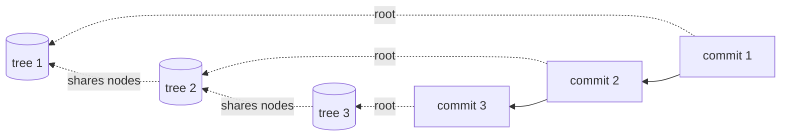

---
tags:
  - versioning
  - storage
---
# Anatomy of a commit

*How a tree root becomes a permanent, named version — and why storing every
version is cheap.*

> **What you'll learn** — what a `Commit` actually is, why its hash commits to
> all of history, how the empty tree is represented, how a commit is published
> through the one mutable part of the system, and why keeping every version
> costs almost nothing.
>
> _Reading time: ~9 minutes._
> _Prerequisites: [the-prolly-tree](../foundations/the-prolly-tree.md),
> [B2 · a write](B2-a-write.md)._

## 0 · The problem

[B2](B2-a-write.md) produced a new tree root — a `Node` hash. But a bare root
hash is anonymous and unreachable: nothing names it, nothing records *when* or
*why* it was made, nothing links it to the version before it. A commit fixes
all three:

```java
Commit commit = new Commit(rootValueHash, parents, author, message, timestamp);
byte[] commitHash = store.write(commit.serialize());
manifest.updateRef(repoId, "main", commitHash, previousCommitHash);
```

Follow a tree root into a durable, named, history-linked version.

## 1 · A commit is a node too

A `Commit` is a small record — and, like every node in this system, it is
**content-addressed**: serialized to bytes and written to the same
`NodeStore`, identified by the hash of those bytes.

```java
private final byte[]       rootValueHash;   // the data tree this commit captures
private final List<byte[]> parents;         // the commit(s) this one descends from
private final String       author;
private final String       message;
private final long         timestamp;
```

`rootValueHash` points at the [B2](B2-a-write.md) data tree. `parents` points
at the previous commit(s) — one for an ordinary commit, two for a merge. Those
parent links make the commits a **directed acyclic graph**: history is a graph you walk backwards
through `getParents()`.

## 2 · Merkle identity — the hash commits to all history

Because a commit's bytes *include its parent hashes*, and a parent's bytes
include *its* parents, a commit's hash transitively commits to **the entire
history behind it** — every ancestor commit and every data tree.

> **Key idea** — a commit hash is a Merkle identity for a whole timeline. Two
> commits have the same hash iff they have identical data *and* identical
> ancestry. Change any byte of any historical commit and every descendant's
> hash changes — history is tamper-evident, and identical histories
> deduplicate automatically.

This is the same content-addressing as [the prolly tree](../foundations/the-prolly-tree.md)
itself, lifted one level up: the tree makes *data* a Merkle directed acyclic graph; the commit
chain makes *time* one.

## 3 · The empty-tree sentinel

A commit's data tree can be **empty** — commit a deletion of the last row and
there is no root `Node` at all, so `rootValueHash` is `null`. But the on-disk
`Commit` format reserves a fixed 20 bytes for the root hash. The resolution:

```java
// serialize():   a null rootValueHash is written as 20 zero bytes
// deserialize(): all-zero 20 bytes map back to a null rootValueHash
```

A real `SHA-512/20` chunk hash is never all-zero, so the sentinel can never
collide with a genuine root.

> **The bug** — before that round-trip existed, an empty-tree commit's `null`
> root flowed straight into read paths that assumed a real hash, throwing a
> `NullPointerException` on what is a perfectly legal commit. The fix was two
> parts: make `null` *round-trip* through the zero sentinel, **and** guard the
> read sites that consume a root. The lesson: the empty collection is a real
> input — a commit that deleted everything is still a commit.

## 4 · Publishing — the one mutable pointer

Everything so far is immutable and content-addressed. But a *branch* must move
— `main` has to mean a new commit after each commit. That mutability is
quarantined into a single component, the **`Manifest`**:

```java
boolean updateRef(String repoId, String name, byte[] newHash, byte[] expectedHash);
```

`updateRef` is a **compare-and-set**: it moves `name` to `newHash` *only if* it
currently points at `expectedHash`. If a concurrent commit moved the ref first,
the compare-and-set fails and the caller must rebase its edits onto the new tip and retry.

> **Key idea** — the `Manifest` is "the only mutable part of the architecture".
> Branches and tags are mutable *names*; everything they point at — commits,
> trees, nodes — is immutable. Concurrency control shrinks to one atomic
> compare-and-set on a name.

## 5 · Why every version is cheap

A commit does not copy the database. It stores one small `Commit` record whose
`rootValueHash` mostly points at **subtrees that already exist**:

- The data tree shares all the nodes the commit's edits didn't touch — from
  [B2](B2-a-write.md), only nodes within a splitter window of an edit are new.
- The commit record itself just *references* its parent by hash; it does not
  embed it.



So a hundred commits over a large dataset cost roughly the dataset *plus a
hundred small deltas* — not a hundred copies. That is what makes
time-travel and the git-flows
practical: history is nearly free because immutability makes sharing total.

## Takeaways

- A `Commit` is a content-addressed record: a data-tree root, parent commit
  hash(es), and metadata — a node in the commit directed acyclic graph.
- Because a commit's bytes include its parents' hashes, its hash commits to all
  of history; tampering is detectable, identical histories deduplicate.
- The empty data tree is a real case, encoded as an all-zero root sentinel that
  round-trips to `null` — a gap that once caused NPEs.
- The `Manifest` is the lone mutable component: branch/tag names move by atomic
  compare-and-set; everything they point at is immutable.
- Every commit shares almost all of its predecessor's nodes, so storing the
  full history costs deltas, not copies.

## Where this lives

- `dolthub-java-port/src/main/java/com/dolthub/prolly/Commit.java` — the commit
  record, `serialize`/`deserialize`, the empty-tree sentinel
- `dolthub-java-port/src/main/java/com/dolthub/prolly/Manifest.java` —
  `updateRef` (the compare-and-set), `getRef`, `deleteRef`
- Builds on: [B2 · a write](B2-a-write.md),
  [the-prolly-tree](../foundations/the-prolly-tree.md)
- Continues in: [B5 · a diff](B5-a-diff.md) — comparing two commits' trees.
