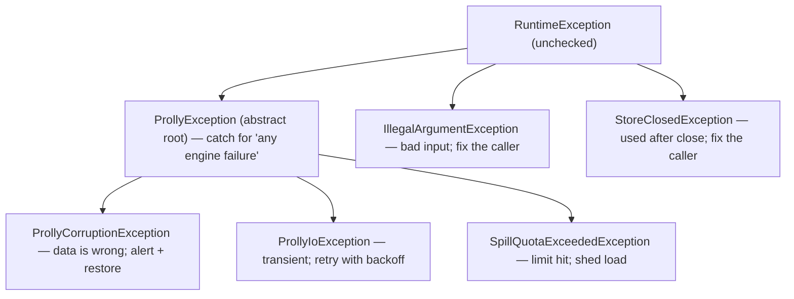

---
tags:
  - architecture
---
# The engine error taxonomy

*One small typed family for everything the storage engine can fail with — so a caller chooses retry, alert, or shed-load by catching a **type**, not by parsing a message.*

> **What you'll learn** — which failures the prolly engine raises, why they are
> split into a small typed hierarchy rooted at `ProllyException`, how a caller
> branches on it (retry a transient input/output error, alert-and-restore on
> corruption, shed load on a resource limit), and — just as important — which
> failures are *deliberately left out* of the family, and why that line is the
> most load-bearing decision in the design.
>
> _Reading time: ~8 minutes._

> **Prerequisites** —
> the-prolly-tree (content addressing — every chunk is
> named by its own hash, which is what makes corruption *detectable* at all),
> the-untrusted-byte-boundary (the sibling
> failure mode: rejecting malformed *incoming* bytes).

## Why it matters

Before this taxonomy, every engine failure looked identical to a caller. A disk
that filled mid-write, a bit-rotted chunk read back from storage, and a single
giant transaction that overflowed its spill-to-disk budget all surfaced as a
bare `RuntimeException` — and the integrity check threw a generic
`IllegalStateException`. A caller that wanted to do something *sensible* about a
failure — a sync server deciding whether to retry a pull, an operations
dashboard deciding whether to wake a human — had exactly one tool: read the
exception's message string and guess.

Message-parsing is a contract made of sand. It breaks the moment someone rewrites
a message for clarity, and it cannot separate two failures that happen to share a
word. The whole point of the taxonomy is to move the meaning from the *message*
into the *type*, so the response becomes a `catch` clause the compiler checks,
not a substring search that rots silently.

## The idea

Sort every failure by the **operational response** it demands, and give each
response its own type. Three responses cover the engine:

- **The data is wrong** → *alert a human, restore from backup.* A retry is futile
  — the same bad bytes come back. → `ProllyCorruptionException`.
- **The operation hit a transient snag** → *retry with backoff.* A RocksDB error,
  a failed durable flush, a disk write that could not complete. → `ProllyIoException`.
- **A configured limit was hit** → *shed load, raise the limit, or batch the
  work.* A blind retry hits the same wall. → `SpillQuotaExceededException`.

All three extend one **abstract** root, `ProllyException`, so a caller that does
*not* care about the distinction catches the root and handles "any engine
failure" uniformly.



> **Key idea** — the type *is* the runbook entry. `catch (ProllyCorruptionException)`
> means "page someone"; `catch (ProllyIoException)` means "retry"; `catch
> (ProllyException)` means "any engine failure, handle generically".

## The key types

| Type | Operational response | Thrown when |
|---|---|---|
| `ProllyException` (abstract) | catch root — never thrown directly | — |
| `ProllyCorruptionException` | alert + restore; do **not** retry | a stored chunk's bytes do not hash to their key |
| `ProllyIoException` | retry with backoff | a RocksDB read/write/flush fails (disk error, disk full) |
| `SpillQuotaExceededException` | shed load / raise quota / batch | a transaction's spill-to-disk would exceed `prolly.spill.max-disk-bytes` |

The root is abstract on purpose — there is no "uncategorized `ProllyException`",
so every failure is forced to pick a category:

```java
// dolthub-java-port/src/main/java/com/dolthub/prolly/ProllyException.java
public abstract class ProllyException extends RuntimeException {
  protected ProllyException(String message) { super(message); }
  protected ProllyException(String message, Throwable cause) { super(message, cause); }
}
```

The throw sites were retrofitted to the family. The corruption type is raised by
the content-verifying read — re-hash the disk bytes, and if they do not match the
key you asked for, the data is wrong:

```java
// RocksNodeStore.read — verify below the cache (ADR-0064)
byte[] actual = HashUtils.hash(data);
if (!Arrays.equals(hash, actual)) {
    throw new ProllyCorruptionException(
        "node integrity check failed at " + HashUtils.toHex(hash)
            + " — stored bytes hash to " + HashUtils.toHex(actual)
            + " (corruption / bit-rot on the disk read)");
}
```

Every RocksDB failure funnels through one helper, `RocksNodeStore.rethrow`, which
now *returns* a `ProllyIoException` (and preserves the original `RocksDBException`
as the cause, plus operator guidance when it detects a full disk).

## Rules & gotchas

The most important decision in the whole design is what the family **excludes**.
Two failure kinds stay out, deliberately:

- **Bad input** — a null argument, an out-of-range index — stays
  `IllegalArgumentException`.
- **Use-after-close** — calling a store after `close()` — stays
  `StoreClosedException` (a plain `RuntimeException`).

Both are *caller bugs*, not operational conditions. You do not retry a null
argument or alert-and-restore on a use-after-close; you fix the call site. Folding
them under `ProllyException` would tempt a `catch (ProllyException)` block — which
exists to handle *operational* failures — into swallowing a programming bug. So
the rule is: **`ProllyException` is for failures that happen through no fault of
the immediate call's arguments.** A caller-fault error keeps standard Java
semantics and propagates past the operational handler, where it belongs.

- > **Gotcha — `instanceof` between two leaves does not compile.**
  > `ProllyCorruptionException` and `ProllyIoException` are both `final`, so the
  > compiler *proves* they are unrelated: `new ProllyCorruptionException(x)
  > instanceof ProllyIoException` is a compile error, not a runtime `false`. The
  > contract test routes the check through the `ProllyException` base a caller
  > actually holds (`ProllyException e = …; e instanceof ProllyIoException`).
- > **Gotcha — corruption has two detectors, one type.** Bytes are verified two
  > ways: inline in `RocksNodeStore.read` (the production default, ADR-0064:
  > "verify below the cache") and by a wrapper, `IntegrityVerifyingNodeStore`
  > (re-hash on every read). **Both throw `ProllyCorruptionException`**, so a
  > caller catches corruption regardless of *which* mechanism caught it. If you
  > add a third detector, throw the same type.
- > **Trade-off — the family is unchecked.** It extends `RuntimeException`, so
  > adding the types cost zero signature churn across the engine. The price is
  > that the compiler will not *force* a caller to handle them — the value is the
  > branchable type for callers who *choose* to, not a checked contract.

## Takeaways

- **The type is the contract, not the message.** Branch on
  `ProllyCorruptionException` / `ProllyIoException` / `SpillQuotaExceededException`,
  never on a parsed message string.
- **Corruption is not retryable; input/output is.** That single distinction is
  why the two are separate types — a retry loop that cannot tell them apart will
  spin forever on bad data.
- **`catch (ProllyException)` catches every *operational* failure** — and
  deliberately not bad-input or use-after-close, which are caller bugs to fix, not
  conditions to handle.
- **One corruption type, however it was detected.** Add a new throw site? Map it
  to the existing category; do not invent a parallel one.
- **The root is abstract** so no failure can dodge categorization.

## Where to go next

- the-untrusted-byte-boundary — the *other*
  half of failure handling: rejecting malformed *incoming* bytes before they
  become state (a controlled exception, never a crash). Corruption here is about
  *stored* bytes going bad; that doc is about *arriving* bytes being hostile.
- the-chunk-store — `RocksNodeStore`, the store that raises
  most of these.
- memory-attribution-hierarchy — the
  resource-pressure gauges that let an operator see a `SpillQuotaExceededException`
  (or a native limit) building *before* it fires.

## Where this lives

- `dolthub-java-port/src/main/java/com/dolthub/prolly/ProllyException.java` — the abstract catch root.
- `dolthub-java-port/src/main/java/com/dolthub/prolly/ProllyCorruptionException.java` — data-is-wrong; do not retry.
- `dolthub-java-port/src/main/java/com/dolthub/prolly/ProllyIoException.java` — transient input/output; retryable.
- `dolthub-java-port/src/main/java/com/dolthub/prolly/SpillQuotaExceededException.java` — the resource-limit member.
- `prolly-storage/src/main/java/com/earasoft/prolly/storage/RocksNodeStore.java` — `read` raises the corruption type; `rethrow` wraps every RocksDB failure as `ProllyIoException`.
- `prolly-storage/src/main/java/com/earasoft/prolly/IntegrityVerifyingNodeStore.java` — the second corruption detector (the decorator), same type.
- `prolly-storage/src/main/java/com/earasoft/prolly/storage/StoreClosedException.java` — the deliberately-excluded lifecycle error.
- `dolthub-java-port/src/test/java/com/dolthub/prolly/ProllyExceptionHierarchyTest.java` — pins the catch-contract.
- `dolthub-java-port/plans/core-error-taxonomy-and-failpaths.md` *(private monorepo work tracker)* — the plan this came from.
