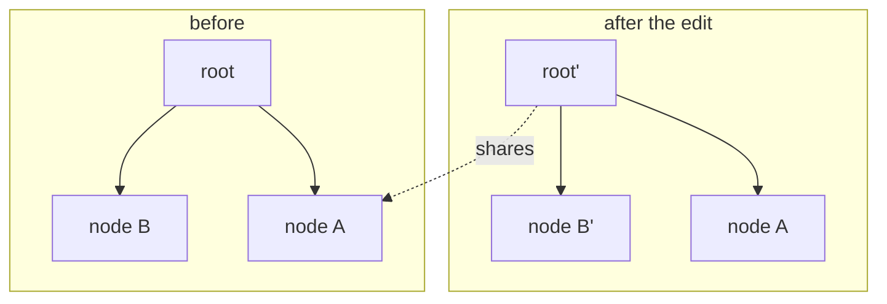

---
tags:
  - storage
  - versioning
---
# The prolly tree

*Why every node is named by the hash of its own bytes — and what that buys.*

> **What you'll learn** — what a prolly tree is, the three properties that
> define it (content addressing, immutability, history-independence), and why
> those properties make `diff` and `merge` cheap where an ordinary B-tree makes
> them expensive. Every other doc in this project rests on this one.
>
> _Reading time: ~10 minutes._

## Why it matters

A normal database is good at *what is true now*. Ask it *what changed since
last week*, *who changed it*, or *merge these two divergent edits* and it has
no good answer — those are version-control questions, and a B-tree was not
built to answer them.

Git answers exactly those questions for source files. The **prolly tree** —
*probabilistic B-tree* — is the data structure that answers them for
**ordered key/value data at scale**. It is the structure behind
[Dolt](https://github.com/dolthub/dolt)'s "Git for data", and it is what
`dolthub-java-port` ports to Java. Get this structure, and branching, diffing,
time-travel, and 3-way merge stop being bolted-on features and become
properties that fall out of the shape of the tree.

## The idea

A prolly tree is a **B-tree that is also a Merkle directed acyclic graph**. Three properties make
it work.

**1 · Content addressing.** A node's address *is* the hash of its bytes —
specifically `SHA-512/20`, the first 20 bytes of a SHA-512 digest (the same
hash Dolt uses). There is no separate ID. Identical bytes always hash to the
same address; different bytes never collide in practice. A leaf node holds the
actual key/value tuples; an internal node holds the *hashes* of its children
plus their subtree counts. So the hash of the root transitively commits to
every byte in the tree — change one value and the root hash changes.

**2 · Immutability.** Nodes are never edited in place. To change a value, you
write a *new* leaf, which forces a new parent (it holds a different child
hash), which forces a new grandparent — a new node all the way up to a new
root. Everything *not* on that path is untouched and **shared** between the old
and new versions:



Editing one key in node B rewrote B, and the root — three nodes — and reused
node A and everything under it. Two full versions of the tree, stored for the
cost of the path that changed.

**3 · History-independence.** This is the property that makes a prolly tree
*not* just a copy-on-write B-tree. In an ordinary B-tree, node boundaries fall
at fixed fan-out counts, so the tree's *shape depends on the order keys were
inserted* — two B-trees holding the identical key/value set can have completely
different internal structure. A prolly tree instead decides node boundaries by
**content-defined chunking**: a rolling hash runs over the serialized keys, and
wherever the hash hits a target pattern, a node boundary is placed. The
boundary depends only on the surrounding *content*, never on insertion order.

The consequence: **the same set of key/value pairs always produces the same
tree shape and the same root hash**, no matter how it was built. And inserting
one key only disturbs the chunk boundaries *near* that key — a local set of
nodes, not the whole tree.

> **Key idea** — content addressing + history-independence means *equal data ⇒
> equal hash ⇒ equal subtree*. Comparing two trees becomes comparing hashes:
> if two subtree hashes match, the data underneath is byte-identical and can be
> skipped wholesale.

> **Prove it live** — both properties check from your terminal against the
> running playground backend: re-insert the same keys shuffled and watch the
> byte-identical root come back, and re-hash a node's raw stored bytes yourself
> to confirm the name is the checksum. The copy-paste transcript:
> [prove it yourself (curl)](../../prolly-playground-service/README.md#prove-it-yourself-curl).

That is why `diff` is cheap. `DiffEngine` walks two roots with paired cursors
and short-circuits: identical root bytes → *no differences at all*; identical
child hashes → skip that entire subtree. The cost of a diff is proportional to
**what changed**, not to how big the dataset is. A B-tree gives you no such
short-circuit — its shape is order-dependent, so you must compare the data
itself. The same property powers 3-way `merge`, time-travel, and blame.

## The key types

In `dolthub-java-port`:

| Type | Responsibility |
|---|---|
| `Node` | One tree node — a leaf (`level == 0`, holds key/value tuples) or an internal node (`level > 0`, holds child hashes + subtree counts). |
| `RollingHashSplitter` | Content-defined chunking — decides where one node ends and the next begins, from content alone. |
| `BuzHash` | The rolling hash function the splitter runs over the key stream. |
| `NodeStore` | The content-addressed store — `read(hash)` / `write(bytes) → hash`. The tree's storage boundary. |
| `HashUtils` | `SHA-512/20` — the addressing hash. |
| `TreeMutator` | Applies edits, rebuilding the path of nodes from a changed leaf up to a new root. |
| `Cursor` | An ordered position in the tree; the basis of iteration, diff, and merge. |
| `DiffEngine` / `MergeEngine` | The hash-skipping diff, and the 3-way merge built on it. |

The storage boundary is one tiny interface — everything content-addressed flows
through it:

```java
public interface NodeStore {
    Optional<MemorySegment> read(byte[] hash);
    byte[] write(MemorySegment data);   // returns the content hash
}
```

## Rules & gotchas

- > **Gotcha** — chunk boundaries are *probabilistic*. The splitter targets a
  > 512 B–16 KB node size; it does not guarantee it. Code must never assume a
  > fixed fan-out or a fixed node count.
- > **Gotcha** — the splitter uses **per-level salts** (a SHA-512 of the level
  > byte) so boundaries at different tree heights don't "vertically align".
  > Without that, one edit could cascade boundary shifts up every level.
- > **Trade-off** — immutability means an edit allocates a whole new path of
  > nodes. That is the price of structural sharing and cheap history; the
  > garbage left behind is reclaimed by a separate reachability-based garbage collection.
- A node's hash commits to *all* its content. Two nodes are interchangeable iff
  their hashes match — this is load-bearing for every short-circuit in the
  project; never compare nodes by anything but their hash.

## Why this is optimized

The structure above isn't just elegant — three properties are load-bearing
optimizations, each with a measured payoff and a wart.

- **Path-only rewrite (`TreeMutator`), O(log n) per edit.** An edit rewrites only
  the nodes on the root→leaf spine; every unchanged sibling subtree is referenced
  by its existing hash, not copied. That structural sharing is what makes
  versioning cheap: the NCIt versioning benchmark measured per-commit cost *flat in
  history depth* — the N-th commit is as cheap as the first (you keep N versions for
  the price of the churn, not the corpus).
- **Level-salted content-defined boundaries (`BuzHash`/`RollingHashSplitter`).**
  A boundary is `(hash & pattern) == pattern` over a 67-byte rolling window, with
  the hash salted by `SHA-512(level)`. The salt stops boundaries at different tree
  heights from *vertically aligning*, maximizing how much two versions share;
  `MIN`/`MAX` chunk sizes (512 B–16 KB) bound worst-case node sizes. Bit-identical
  to Go's `kch42/buzhash` — a single shift typo would break Merkle dedup, so it's
  pinned by a golden vector.
- **History-independence as a free correctness oracle.** Same content → same tree →
  same root hash, regardless of insertion order — so a bulk build *must* hash-equal
  an incremental one. `MerkleDeterminismTest` asserts that across batch / shuffled /
  chunked construction, and `ChunkerDeterminismGateTest` pins the boundary offsets +
  root against golden constants, so any drift in BuzHash, the window, the salt, or
  the serializer layout fails the build.

> **The wart — re-emit, not re-diff.** `TreeMutator` replays the *whole* sorted
> entry stream through the splitter per `applyMutations` — O(existing-tree), not
> O(diff). It removed an earlier structural fast-forward because force-flushing at
> subtree roots produced non-BuzHash boundaries; replaying from scratch guarantees
> convergence, at work proportional to the tree, not the change. That is the
> per-commit cost the four indexes each pay — see
> advanced-topics/the-dictionary-and-four-indexes.

## Takeaways

- A prolly tree is a B-tree that is also a Merkle directed acyclic graph: every node is addressed
  by the `SHA-512/20` hash of its own bytes.
- Edits are immutable and path-copying — a new root, with every unchanged
  subtree shared with the previous version.
- Content-defined chunking makes the tree **history-independent**: the same
  data always yields the same shape and root hash, regardless of insertion
  order. A B-tree cannot promise this.
- That single property collapses `diff` and `merge` from "compare all the data"
  to "compare hashes, skip what matches" — cost proportional to the change.

## Where this lives

- `dolthub-java-port/src/main/java/com/dolthub/prolly/Node.java` — the node
- `dolthub-java-port/src/main/java/com/dolthub/prolly/RollingHashSplitter.java`,
  `BuzHash.java` — content-defined chunking
- `dolthub-java-port/src/main/java/com/dolthub/prolly/NodeStore.java`,
  `HashUtils.java` — content addressing
- `dolthub-java-port/src/main/java/com/dolthub/prolly/TreeMutator.java`,
  `DiffEngine.java`, `MergeEngine.java` — write, diff, merge
- Builds on this: the-memory-model,
  [the-on-disk-format](the-on-disk-format.md)
- Anatomy docs assuming it: [B1 · a chunk boundary](../anatomy/B1-a-chunk-boundary.md)
  through [B6 · a merge](../anatomy/B6-a-merge.md)
